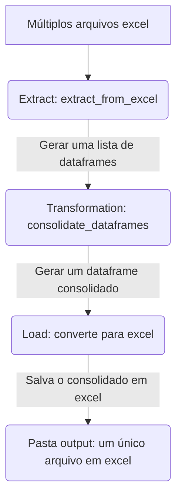

# Projeto de ETL

Estruturação um projeto de dados do zero: extração, transformação e carregamento. Foram aplicadas técnicas de refatorização, melhorando a qualidade do código e otimizando a performance.

Aqui foi possível:

* entender a estrutura padrão de projetos, com a organização dos diretórios, funções e módulos, documentação e testes;
* compreender ferramentas de desenvolvimento como PIP e Poetry;
* realizar testes unitários utilizando o Pytest;
* fazer o versionamento com Git e Github
* **decifrar o que cada arquivo representa** kkk
* documentar todo o projeto usando o Mkdocs

# Estrutura do projeto

# Funções e módulos do projeto

### Função de extração (extract)

#### ::: app.pipeline.extract.extract_from_excel

### Função de transformação (transform) de dados

#### ::: app.pipeline.transform.contact_data_frames

### Função de carregamento (load) de dados

#### ::: app.pipeline.load.load_excel
